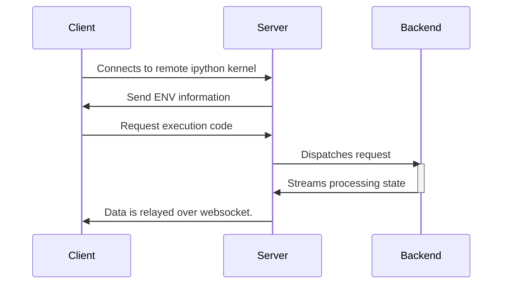

# Armory Jupyter Extension

### Server
```
jupyter --no-browser --port=9090
```

### Client

---


```mermaid
sequenceDiagram
    participant Client
    participant Server
    participant Backend
    Client->>Server: Connects to remote ipython kernel
    Server->>Client: Send ENV information
    Client->>Server: Request execution code
    Server->>Backend: Dispatches request
    activate Backend
    Backend->>Server: Streams processing state
    deactivate Backend
    Server->>Client: Data is relayed over websocket.
```
